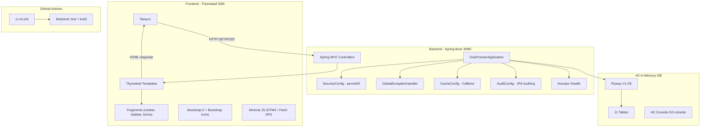

# PHASE 0: PROJECT SKELETON (Proje İskeleti)

| Field | Value |
|-------|-------|
| Version | 1.0.0 |
| Status | In Review |
| Document Owner | Senior Architect |
| Last Updated | 2026-02-28 |
| Estimated Duration | 1 hafta (5 iş günü) |
| Sprint Count | 1 sprint |
| Priority | Critical |

---

## 1. EXECUTIVE SUMMARY

Bu faz, GoalTracker Pro projesinin tüm altyapısını sıfırdan kurar. Spring Boot 3.3 + Java 21 backend ve Thymeleaf + Bootstrap 5 ile server-side rendering yapısını oluşturur, H2 in-memory veritabanı şemasını Flyway migration'ları ile hazırlar, temel UI parçalarını inşa eder ve CI/CD pipeline'ını yapılandırır.

**İş değeri:** Sonraki 9 fazın tamamı bu iskelet üzerine inşa edilecektir. Hatalı veya eksik bir iskelet, her sonraki fazda teknik borç ve yeniden çalışma üretir.

**Bu faz atlanırsa:** Proje başlayamaz. Veritabanı şeması, güvenlik altyapısı, frontend bileşen kütüphanesi ve CI/CD olmadan hiçbir feature geliştirilemez.

**Faz bağlantıları:** Bağımlılığı yoktur (başlangıç fazı). Faz 1 (Authentication) doğrudan bu fazın çıktılarına bağımlıdır — `ApiResponse<T>`, `GlobalExceptionHandler`, `SecurityConfig` placeholder, `apiClient.ts`, layout bileşenleri ve Flyway V1 migration.

---

## 2. REVIEW FINDINGS

### 2.1 Critical Gaps Identified

| ID | Gap Description | Recommended Fix |
|----|----------------|-----------------|
| `[GAP-001]` | `spring-boot-starter-actuator` bağımlılığı eksik ama kabul kriterlerinde actuator health check var | `pom.xml`'e `spring-boot-starter-actuator` ekle |
| `[GAP-002]` | `spring-boot-starter-cache` + `caffeine` bağımlılığı eksik ama `CacheConfig.java` task'ta var | `pom.xml`'e her iki bağımlılığı ekle |
| `[GAP-003]` | `SecurityConfig` Phase 0'da nasıl konfigüre edileceği belirsiz — auth yok ama security starter var | Phase 0'da `permitAll()` geçici config yaz, `// TODO: Phase 1'de güncelle` notu ekle |
| `[GAP-004]` | Flyway migration DDL'leri tam metin olarak yok, sadece ana plana referans verilmiş | Her migration dosyasının tam SQL DDL'ini bu dokümana ekle |
| `[GAP-005]` | `ErrorCode` enum değerleri listelenmemiş | Tüm enum değerlerini HTTP status mapping ile birlikte tanımla |
| `[GAP-006]` | `application.yml` tam içeriği eksik — "şablon oluştur" denmiş | Ana plandan alınan tam YAML içeriğini profile'lar dahil ekle |
| `[GAP-007]` | UI bileşenleri için Props/State TypeScript interface tanımları yok | Her bileşen için detaylı Props/State interface tanımla |
| `[GAP-008]` | CI/CD pipeline detayları eksik — Java version, caching, artifact gibi bilgiler yok | Tam `ci-cd.yml` YAML dosyası oluştur |
| `[GAP-009]` | Test stratejisi tamamen eksik — tek bir context loading testi bile belirtilmemiş | Backend smoke test + frontend lint/type-check test stratejisi ekle |
| `[GAP-010]` | Docker kullanılmıyor notu var ama ana plan `docker-compose.yml` referans ediyor | Her iki yolu da dokümante et, `docker-compose.yml` opsiyonel olarak ekle |
| `[GAP-011]` | Frontend `index.html` meta tags, favicon, title eksik | `index.html` şablonunu meta bilgilerle birlikte tanımla |
| `[GAP-012]` | CORS konfigürasyonu Phase 0'da nasıl handle edileceği belirsiz | `SecurityConfig`'de `CorsConfigurationSource` bean tanımla |
| `[GAP-013]` | Bundle size limitleri ve Lighthouse hedefleri yok | Performance requirements bölümü ekle |
| `[GAP-014]` | `package-info.java` dosyalarının amacı ve içeriği belirsiz | Javadoc ile paket açıklaması içeren örnekler ekle |
| `[GAP-015]` | Flyway `baseline-on-migrate` ana planda `true` ama risk taşıyor | Geliştirme ortamında `true`, prod'da `false` olarak ayarla |
| `[GAP-016]` | `@EnableScheduling` konfigürasyonu eksik (Faz 5 için hazırlık) | `SchedulerConfig.java` placeholder ekle |

### 2.2 Assumptions Made

| ID | Assumption                                                                       |
|----|----------------------------------------------------------------------------------|
| `[ASSUMPTION-001]` | H2 in-memory veritabanı kullanılacak — harici DB kurulumu gerekmez             |
| `[ASSUMPTION-002]` | Java 21 (LTS) JDK kurulu ve `JAVA_HOME` ayarlı                                   |
| `[ASSUMPTION-003]` | Node.js veya harici frontend build aracı gerekmez — Thymeleaf server-side render  |
| `[ASSUMPTION-004]` | Git 2.40+ kurulu                                                                 |
| `[ASSUMPTION-005]` | GitHub hesabı mevcut ve SSH key konfigüre edilmemiş.                             |
| `[ASSUMPTION-006]` | Maven kullanılacak (Gradle değil) — `pom.xml` ile bağımlılık yönetimi         |
| `[ASSUMPTION-007]` | H2 in-memory veritabanı kullanılacak (PostgreSQL, Docker YOK)                    |
| `[ASSUMPTION-008]` | Tüm UI metinleri Türkçe olacak                                                   |
| `[ASSUMPTION-009]` | Proje tek modül Spring Boot projesi — Thymeleaf template'ler src/main/resources/templates içinde |
| `[ASSUMPTION-010]` | IDE olarak IntelliJ IDEA kullanılıyor                                            |

### 2.3 New Features & Improvements Added

| ID | Feature | Justification |
|----|---------|---------------|
| `[NEW-001]` | `spring-boot-starter-actuator` eklendi | Health check endpoint'i kabul kriterlerinde mevcut, production readiness için zorunlu |
| `[NEW-002]` | `SchedulerConfig.java` placeholder | Faz 5 (Streak) ve Faz 6 (Bildirim) scheduler'ları bu config'e bağımlı |
| `[NEW-003]` | `WebSocketConfig.java` placeholder | Faz 6 WebSocket bildirimleri için altyapı hazırlığı
| `[NEW-005]` | `AuditConfig.java` — JPA Auditing (`@EnableJpaAuditing`) | `@CreationTimestamp`/`@UpdateTimestamp` alanları için global auditing desteği |
| `[NEW-006]` | `fragments/form.html` — textarea, input Thymeleaf fragment'leri | Form sayfalarında (hedef açıklaması, entry notu) gerekli |
| `[NEW-007]` | `fragments/confirm-modal.html` — silme onay modal fragment | Silme ve durum değiştirme işlemlerinde kullanıcı onayı gerekli |
| `[NEW-008]` | `fragments/pagination.html` — sayfalama fragment | Liste sayfalarında sayfalama kontrolü gerekli |
| `[NEW-009]` | Bootstrap 5 `data-bs-theme` dark mode altyapısı | Dark mode desteği |
| `[NEW-010]` | `<title th:text="...">` — Thymeleaf sayfa başlığı yönetimi | SEO ve erişilebilirlik |
| `[NEW-011]` | `.editorconfig` dosyası | Takım genelinde tutarlı kod stili |
| `[NEW-012]` | Checkstyle konfigürasyonu | Java kod kalitesi ve tutarlılık |

---

## 3. OBJECTIVES & SUCCESS CRITERIA

### 3.1 Primary Objectives

1. Spring Boot 3.3 + Java 21 backend projesi `mvn spring-boot:run` ile hatasız çalışmalıdır
2. Thymeleaf template'leri Spring MVC ile entegre çalışmalı, sayfalar tarayıcıda render edilmelidir
3. H2 in-memory veritabanında Flyway V1–V8 migration'ları sırasıyla uygulanmalı ve 11 tablo oluşmalıdır
4. CI/CD pipeline `main` branch push'unda otomatik olarak test ve build yapmalıdır
5. Temel Thymeleaf layout şablonu (navbar + sidebar + içerik alanı) render edilebilir durumda olmalıdır
6. Hata yönetimi altyapısı (`GlobalExceptionHandler` + `ErrorCode`) çalışır durumda olmalıdır

### 3.2 Definition of Done

- [ ] `mvn spring-boot:run` komutu başarıyla çalışır, uygulama `http://localhost:8080` üzerinde ayağa kalkar
- [ ] Flyway başlangıçta V1-V8 tüm migration'ları sırasıyla uygular, hata vermez
- [ ] H2 in-memory veritabanında tam olarak **11 tablo** oluşur: `users`, `goals`, `goal_entries`, `streaks`, `badges`, `user_badges`, `friendships`, `goal_shares`, `notifications`, `notification_settings` + `flyway_schema_history`
- [ ] `badges` tablosunda **7 seed kayıt** bulunur (V8 migration)
- [ ] `GET http://localhost:8080/actuator/health` → `{"status":"UP"}` döner
- [ ] `GlobalExceptionHandler` tüm hata tiplerine standart `ApiResponse` döner
- [ ] `mvn test` çalışır (test sayısı ≥ 1, hata yoktur)
- [ ] `pom.xml` bağımlılıkları `mvn dependency:tree` ile çözümlenir, conflict yoktur
- [ ] `http://localhost:8080` tarayıcıda açılır, Thymeleaf layout (navbar + sidebar) render edilir
- [ ] `http://localhost:8080/h2-console` H2 konsolu erişilebilir (dev profili)
- [ ] Tüm UI metinleri Türkçedir
- [ ] Git repo oluşturulmuş, `main` ve `develop` branch'leri mevcut
- [ ] İlk commit `feat: project skeleton` mesajıyla atılmış
- [ ] `.gitignore` dosyaları hassas dosyaları (`.env`, `target/`) kapsamaktadır
- [ ] GitHub Actions CI/CD pipeline dosyası (`ci-cd.yml`) mevcut ve sözdizimi geçerli
- [ ] Hiçbir secret (şifre, JWT key) kaynak koduna commit edilmemiş

### 3.3 Out of Scope

| Item | Neden Kapsam Dışı |
|------|--------------------|
| Kullanıcı authentication/authorization | Faz 1'de yapılacak |
| REST API endpoint'leri (auth, goals vb.) | Faz 1-2'de yapılacak |
| İş mantığı içeren service sınıfları | Faz 1+ fazlarında yapılacak |
| Entity sınıfları (User, Goal vb.) | Faz 1-2'de yapılacak — sadece migration DDL'leri bu fazda |
| E2E testler (Playwright) | Faz 9'da yapılacak |
| Production deployment (Docker image, Nginx) | Faz 9'da yapılacak |
| Dark mode tam implementasyonu | Bu fazda sadece altyapı, görsel tasarım sonraki fazlarda |

---

## 4. FEATURE SPECIFICATIONS

### Feature 1: Backend Proje Oluşturma (Spring Boot + Maven)

- **User Story:** Geliştirici olarak, Spring Boot 3.3 + Java 21 backend projesini tek komutla ayağa kaldırabilmek istiyorum ki geliştirmeye hemen başlayabileyim.
- **Acceptance Criteria:**
  ```gherkin
  Given Spring Boot projesi oluşturulmuş
  When mvn spring-boot:run komutu çalıştırılır
  Then uygulama http://localhost:8080 üzerinde başlar
  And Flyway V1-V8 migration'ları sırasıyla uygulanır
  And GET /actuator/health 200 OK ve {"status":"UP"} döner

  Given pom.xml bağımlılıkları tanımlanmış
  When mvn dependency:tree komutu çalıştırılır
  Then dependency conflict yoktur
  And tüm compile/runtime bağımlılıkları çözümlenir
  ```
- **Business Rules:**
  - BR-001: Maven kullanılmalıdır (Gradle değil) — `pom.xml` ile bağımlılık yönetimi
  - BR-002: `ddl-auto: validate` — Hibernate sadece Flyway şemasını doğrular, tablo oluşturmaz
  - BR-003: Lombok annotationProcessor sırası: Lombok önce, MapStruct sonra (`maven-compiler-plugin` konfigürasyonu)
  - BR-004: Tüm Flyway migration dosyaları immutable'dır — hata varsa yeni `V{N}__fix_...sql` yazılır
- **Edge Cases:**
  - H2 başlatamazsa → Uygulama açık hata mesajıyla başlamaz (`DataSource initialization failed`)
  - Flyway migration'larından biri hatalıysa → Uygulama başlamaz, flyway_schema_history'de failed kayıt oluşur
  - `JWT_SECRET` env değişkeni tanımlanmamışsa → Uygulama başlar ama Phase 1'de hata verir (Phase 0'da security `permitAll()`)
- **Validation Rules:**
  - `application.yml` — tüm zorunlu property'ler default değerle tanımlı olmalı
  - `pom.xml` — versiyon conflict olmamalı (`mvn dependency:tree` ile doğrula)
- **Priority:** Must Have

### Feature 2: Flyway Database Migration (V1-V8)

- **User Story:** Geliştirici olarak, uygulama ilk çalıştığında veritabanı şemasının otomatik oluşmasını istiyorum ki manuel SQL çalıştırmak zorunda kalmayayım.
- **Acceptance Criteria:**
  ```gherkin
  Given PostgreSQL goaltracker veritabanı oluşturulmuş
  When uygulama ilk kez başlatılır
  Then 10 kullanıcı tablosu + flyway_schema_history = 11 tablo oluşur
  And badges tablosunda 7 seed kayıt bulunur
  And tüm FK constraint'ler doğru referans verir
  And tüm index'ler oluşturulmuştur

  Given migration V3 hatalı olarak değiştirilmiş
  When uygulama yeniden başlatılır
  Then Flyway checksum hatası verir
  And uygulama başlamaz (veri koruması)
  ```
- **Business Rules:**
  - BR-005: Migration sırası değiştirilemez — her migration öncekinin tablolarına FK referans verir
  - BR-006: `UNIQUE` constraint'ler DDL'de tanımlanmalı, application-level'da değil
  - BR-007: Tüm `TIMESTAMPTZ` alanları timezone-aware olmalı
  - BR-008: `BIGSERIAL` primary key kullanılmalı (UUID değil)
- **Edge Cases:**
  - Veritabanı boş değilse ve `baseline-on-migrate: true` → Mevcut tablolar korunur, eksik migration'lar uygulanır
  - Aynı migration iki kez çalıştırılmaya çalışılırsa → Flyway idempotent, checksum ile kontrol eder
- **Priority:** Must Have

### Feature 3: Global Exception Handling & Error Response

- **User Story:** Frontend geliştirici olarak, tüm API hatalarının tutarlı bir JSON formatında dönmesini istiyorum ki hata yönetimini merkezi olarak yapabileyim.
- **Acceptance Criteria:**
  ```gherkin
  Given GlobalExceptionHandler aktif
  When validasyon hatası oluşur (MethodArgumentNotValidException)
  Then 400 status ile ApiResponse döner
  And errorCode = "VALIDATION_ERROR"
  And errorMessage alan bazlı hata listesi içerir

  Given GlobalExceptionHandler aktif
  When beklenmeyen bir Exception oluşur
  Then 500 status ile ApiResponse döner
  And errorCode = "INTERNAL_ERROR"
  And stack trace response'a dahil EDİLMEZ (güvenlik)
  ```
- **Business Rules:**
  - BR-009: Hiçbir endpoint raw exception stack trace döndürmemeli
  - BR-010: Tüm hata yanıtları `ApiResponse<T>` wrapper formatında olmalı
  - BR-011: `errorCode` enum değeri, `errorMessage` insan-okunabilir açıklama
- **Edge Cases:**
  - Aynı anda birden fazla validasyon hatası → Tüm alan hataları tek yanıtta listelenir
  - `null` body ile POST isteği → `HttpMessageNotReadableException` → 400
  - Bilinmeyen endpoint → 404, `ApiResponse` formatında
- **Priority:** Must Have

### Feature 4: Frontend Proje Oluşturma (React + Vite + pnpm)

- **User Story:** Geliştirici olarak, React + TypeScript frontend projesini `pnpm dev` ile başlatabilmek ve backend API'ye proxy üzerinden erişebilmek istiyorum.
- **Acceptance Criteria:**
  ```gherkin
  Given frontend projesi oluşturulmuş
  When pnpm dev komutu çalıştırılır
  Then uygulama http://localhost:5173 üzerinde açılır
  And TypeScript strict mode aktif, derleme hatası yok
  And TailwindCSS sınıfları doğru uygulanır

  Given vite proxy konfigüre edilmiş
  When frontend /api/actuator/health isteği yapar
  Then istek localhost:8080'e yönlendirilir
  And backend yanıtı frontend'e iletilir
  ```
- **Business Rules:**
  - BR-012: pnpm kullanılmalıdır (npm/yarn değil)
  - BR-013: TypeScript `strict: true`, `any` tipi yasak
  - BR-014: `VITE_API_URL` env değişkeninden okunmalı, hardcode edilmemeli
  - BR-015: Path alias `@/` → `./src/` tanımlı olmalı
- **Edge Cases:**
  - Backend çalışmıyorken proxy isteği → 502 Bad Gateway, frontend hata göstermeli
  - `pnpm build` production build → `dist/` klasörü oluşur, dead code elimination yapılır
- **Priority:** Must Have

### Feature 5: UI Bileşen Kütüphanesi

- **User Story:** Frontend geliştirici olarak, tutarlı ve yeniden kullanılabilir UI bileşenlerinin hazır olmasını istiyorum ki sonraki fazlarda hızlı geliştirme yapabileyim.
- **Acceptance Criteria:**
  ```gherkin
  Given Button bileşeni oluşturulmuş
  When variant="primary" ve size="md" ile render edilir
  Then mavi arkaplan, beyaz metin, medium boyut gösterilir
  And loading=true ise spinner gösterilir, tıklama devre dışıdır

  Given Modal bileşeni oluşturulmuş
  When isOpen=true ile render edilir
  Then backdrop ile modal gösterilir
  And Escape tuşu veya backdrop tıklaması ile kapanır
  And focus trap aktiftir (erişilebilirlik)
  ```
- **Business Rules:**
  - BR-016: Tüm bileşenler `clsx` + `tailwind-merge` (`cn()`) ile class birleştirmeli
  - BR-017: Tüm bileşenler `React.forwardRef` ile ref desteği sunmalı
  - BR-018: Tüm interactive bileşenler keyboard navigasyon desteklemeli (a11y)
- **Edge Cases:**
  - ProgressBar `value > max` → %100'de clamp edilir
  - Toast birden fazla aynı anda → Stack/queue olarak gösterilir
  - Modal içinde Modal → Z-index stacking context doğru yönetilir
  - EmptyState `action` prop verilmezse → CTA butonu gösterilmez
- **Priority:** Must Have

### Feature 6: Layout Bileşenleri (AppLayout, Navbar, Sidebar)

- **User Story:** Kullanıcı olarak, uygulamada tutarlı bir navigasyon yapısı (sidebar + navbar + içerik alanı) görmek istiyorum.
- **Acceptance Criteria:**
  ```gherkin
  Given AppLayout render edilmiş
  When sayfa yüklendiğinde
  Then sol tarafta Sidebar, üstte Navbar, ortada içerik alanı gösterilir
  And Sidebar'da menü öğeleri: Dashboard, Hedefler, Sosyal, Ayarlar

  Given mobil ekran boyutu (< 768px)
  When sayfa yüklendiğinde
  Then Sidebar gizlidir, hamburger menü ile açılır
  And içerik alanı tam genişliktir
  ```
- **Business Rules:**
  - BR-019: Sidebar genişliği: desktop 256px, collapsed 64px
  - BR-020: Navbar yüksekliği: 64px
  - BR-021: Responsive breakpoints: mobile (<768px), tablet (768-1024px), desktop (>1024px)
- **Priority:** Must Have

### Feature 7: Git Repository & CI/CD Pipeline

- **User Story:** Geliştirici olarak, her push'ta otomatik olarak test ve build çalışmasını istiyorum ki broken code main branch'e ulaşamasın.
- **Acceptance Criteria:**
  ```gherkin
  Given GitHub repo oluşturulmuş
  When feature branch'ten main'e PR açılır
  Then CI/CD pipeline otomatik tetiklenir
  And backend testleri çalışır (mvn verify)
  And tüm testler geçerse PR merge edilebilir

  Given branch stratejisi konfigüre edilmiş
  When geliştirici yeni özellik geliştirmeye başlar
  Then develop branch'ten feature/GT-{N}-kisa-aciklama branch'i oluşturur
  And conventional commit mesajları kullanır
  ```
- **Business Rules:**
  - BR-023: Commit format: `feat|fix|test|docs|refactor(scope): açıklama`
  - BR-024: CI/CD pipeline süresi < 5 dakika hedef
- **Edge Cases:**
  - CI/CD'de PostgreSQL yok → Backend testleri embedded H2 veya Testcontainers kullanır
  - pnpm cache miss → İlk çalışmada yavaş, sonraki çalışmalarda cache aktif
- **Priority:** Must Have

---

## 5. TECHNICAL ARCHITECTURE

### 5.1 Component Overview

| Component | Layer | Responsibility |
|-----------|-------|---------------|
| `GoalTrackerApplication.java` | Backend/Main | Spring Boot application entry point |
| `ApiResponse<T>` | Backend/DTO | Standart REST API response wrapper |
| `GlobalExceptionHandler` | Backend/Exception | Merkezi hata yakalama ve standart yanıt |
| `ErrorCode` | Backend/Exception | Enum bazlı hata kodu kataloğu |
| `CacheConfig` | Backend/Config | Caffeine cache yapılandırması |
| `SecurityConfig` (placeholder) | Backend/Config | Spring Security geçici `permitAll()` |
| `AuditConfig` | Backend/Config | JPA Auditing (`@EnableJpaAuditing`) |
| `SchedulerConfig` (placeholder) | Backend/Config | `@EnableScheduling` — Faz 5 hazırlık |
| `WebSocketConfig` (placeholder) | Backend/Config | STOMP WebSocket — Faz 6 hazırlık |
| Flyway V1-V8 | Backend/Migration | Veritabanı şema versiyonlama |
| `layout/base.html` | Thymeleaf/Layout | Ortak sayfa iskelet şablonu (navbar, sidebar, footer) |
| `layout/navbar.html` | Thymeleaf/Fragment | Üst navigasyon fragment'i |
| `layout/sidebar.html` | Thymeleaf/Fragment | Sol menü fragment'i |
| `fragments/` | Thymeleaf/UI | Yeniden kullanılabilir UI fragment'leri |
| `ci-cd.yml` | Infra/CI | GitHub Actions pipeline |

### 5.2 Technology Stack

| Layer | Technology | Version | Why This Choice |
|-------|-----------|---------|-----------------|
| Backend Framework | Spring Boot | 3.3.x | Enterprise-grade, mature ecosystem, Java 21 desteği |
| Backend Language | Java | 21 (LTS) | Virtual threads, pattern matching, record classes |
| Build Tool | Maven | 3.9.x | Standart Java/Spring ekosistemi, `pom.xml`, spring-boot-maven-plugin |
| ORM | Spring Data JPA + Hibernate | 6.x | Standart JPA, JPQL, pagination desteği |
| Migration | Flyway | 9.x | Versioned migration, checksum validation |
| Security | Spring Security | 6.x | JWT filter chain, CORS, CSRF |
| Cache | Caffeine | 3.x | High-performance in-memory cache |
| Mapping | MapStruct | 1.5.5 | Compile-time type-safe DTO mapping |
| Boilerplate | Lombok | latest | `@Data`, `@Builder`, `@Slf4j` |
| JWT | jjwt (io.jsonwebtoken) | 0.12.x | Lightweight JWT library |
| Rate Limiting | Bucket4j | latest | Token bucket algorithm |
| Mail | Spring Mail | 3.3.x | SMTP email gönderimi |
| Excel Export | Apache POI | 5.x | .xlsx file generation |
| PDF Export | iText 7 | latest | PDF generation |
| WebSocket | Spring WebSocket (STOMP) | 3.3.x | Real-time bildirim |
| Testing | JUnit 5 + Mockito | latest | Unit + mock testing |
| Test DB | H2 in-memory | latest | Entegrasyon testleri için hafif DB |
| View Technology | Thymeleaf | 3.x | Server-side template engine, Spring ile yerel entegrasyon |
| Styling | Bootstrap | 5.x | Hazır bileşenler, responsive grid |
| HTTP Client | Fetch API / HTMX | latest | Server-rendered sayfalar için minimal JS |
| Charts | Chart.js | 4.x | Canvas tabanlı grafik kütüphanesi |
| Icons | Bootstrap Icons | latest | SVG ikon seti |
| Database | H2 in-memory | embedded | Geliştirme/test için hafif, sıfır konfigürasyon |
| CI/CD | GitHub Actions | — | GitHub native, free tier |

### 5.3 Architecture Diagram



### 5.4 Data Flow

**Backend Startup Flow:**
1. `GoalTrackerApplication.main()` çalışır
2. Spring Boot auto-configuration başlatılır
3. `DataSource` H2 in-memory DB'ye bağlanır
4. Flyway aktif → `db/migration/` klasöründeki V1-V8 dosyalarını sırasıyla çalıştırır
5. Hibernate `ddl-auto: validate` → Flyway'in oluşturduğu şemayı entity'lerle karşılaştırır (Phase 0'da entity yok, validasyon atlanır)
6. `SecurityConfig` yüklenir → `permitAll()` geçici config
7. `CacheConfig` yüklenir → Caffeine cache manager başlatılır
8. Thymeleaf template engine yapılandırılır
9. Actuator endpoint'leri aktifleşir → `/actuator/health` hazır
10. Tomcat embedded server `8080` portunda başlar
11. Uygulama `Started GoalTrackerApplication` log'u ile hazır

**Request → Response Flow (Thymeleaf SSR):**
1. Tarayıcı `GET /goals` isteği gönderir
2. Spring MVC → `GoalController.listGoals()` çağrılır
3. Service katmanı → Repository → H2 DB sorgusu
4. Model doldurulur ve `goals/list` view name döndürülür
5. Thymeleaf `templates/goals/list.html` render eder
6. HTML response tarayıcıya gönderilir

---

## 6. DATABASE DESIGN

### 6.1 New / Modified Tables

Flyway ile oluşturulacak tüm tabloların tam DDL'i:

**V1__create_users.sql**
```sql
CREATE TABLE users (
    id              BIGSERIAL    PRIMARY KEY,
    email           VARCHAR(255) NOT NULL UNIQUE,
    username        VARCHAR(100) NOT NULL UNIQUE,
    password_hash   VARCHAR(255) NOT NULL,
    display_name    VARCHAR(200),
    avatar_url      TEXT,
    timezone        VARCHAR(50)  NOT NULL DEFAULT 'UTC',
    role            VARCHAR(20)  NOT NULL DEFAULT 'USER',
    is_active       BOOLEAN      NOT NULL DEFAULT TRUE,
    email_verified  BOOLEAN      NOT NULL DEFAULT FALSE,
    created_at      TIMESTAMPTZ  NOT NULL DEFAULT NOW(),
    updated_at      TIMESTAMPTZ  NOT NULL DEFAULT NOW()
);

CREATE INDEX idx_users_email    ON users(email);
CREATE INDEX idx_users_username ON users(username);
```
- **Relationships:** `id` referenced by `goals.user_id`, `friendships.requester_id/receiver_id`, `goal_shares.shared_with_user_id`, `notifications.user_id`, `notification_settings.user_id`, `user_badges.user_id`
- **Sample data:** Phase 0'da yok, V8 seed sadece badges tablosu için

**V2__create_goals.sql**
```sql
CREATE TABLE goals (
    id            BIGSERIAL     PRIMARY KEY,
    user_id       BIGINT        NOT NULL REFERENCES users(id) ON DELETE CASCADE,
    title         VARCHAR(200)  NOT NULL,
    description   TEXT,
    unit          VARCHAR(50)   NOT NULL,
    goal_type     VARCHAR(20)   NOT NULL,
    frequency     VARCHAR(20)   NOT NULL DEFAULT 'DAILY',
    target_value  NUMERIC(10,2) NOT NULL,
    start_date    DATE          NOT NULL,
    end_date      DATE          NOT NULL,
    category      VARCHAR(50),
    color         VARCHAR(7),
    status        VARCHAR(20)   NOT NULL DEFAULT 'ACTIVE',
    created_at    TIMESTAMPTZ   NOT NULL DEFAULT NOW(),
    updated_at    TIMESTAMPTZ   NOT NULL DEFAULT NOW(),
    CONSTRAINT chk_goals_dates  CHECK (end_date > start_date),
    CONSTRAINT chk_goals_target CHECK (target_value > 0)
);

CREATE INDEX idx_goals_user_id     ON goals(user_id);
CREATE INDEX idx_goals_status      ON goals(status);
CREATE INDEX idx_goals_user_status ON goals(user_id, status);
```
- **Relationships:** `user_id` referenced by `users.id`, `goal_entries.goal_id`, `friendships.requester_id`, `goal_shares.shared_with_user_id`, `notifications.user_id`, `notification_settings.user_id`, `user_badges.user_id`

**V3__create_goal_entries.sql**
```sql
CREATE TABLE goal_entries (
    id            BIGSERIAL     PRIMARY KEY,
    goal_id       BIGINT        NOT NULL REFERENCES goals(id) ON DELETE CASCADE,
    entry_date    DATE          NOT NULL,
    actual_value  NUMERIC(10,2) NOT NULL,
    note          TEXT,
    created_at    TIMESTAMPTZ   NOT NULL DEFAULT NOW(),
    updated_at    TIMESTAMPTZ   NOT NULL DEFAULT NOW(),
    UNIQUE(goal_id, entry_date),
    CONSTRAINT chk_entry_value CHECK (actual_value >= 0)
);

CREATE INDEX idx_goal_entries_goal_id    ON goal_entries(goal_id);
CREATE INDEX idx_goal_entries_entry_date ON goal_entries(entry_date);
CREATE INDEX idx_goal_entries_goal_date  ON goal_entries(goal_id, entry_date DESC);
```
- **Relationships:** `goal_id` referenced by `goals.id`, `streaks.goal_id`, `user_badges.goal_id`

**V4__create_streaks.sql**
```sql
CREATE TABLE streaks (
    id              BIGSERIAL   PRIMARY KEY,
    goal_id         BIGINT      NOT NULL UNIQUE REFERENCES goals(id) ON DELETE CASCADE,
    current_streak  INT         NOT NULL DEFAULT 0,
    longest_streak  INT         NOT NULL DEFAULT 0,
    last_entry_date DATE,
    updated_at      TIMESTAMPTZ NOT NULL DEFAULT NOW()
);
```
- **Relationships:** `goal_id` referenced by `goals.id`

**V5__create_badges.sql**
```sql
CREATE TABLE badges (
    id               BIGSERIAL    PRIMARY KEY,
    code             VARCHAR(50)  NOT NULL UNIQUE,
    name             VARCHAR(100) NOT NULL,
    description      TEXT         NOT NULL,
    icon             VARCHAR(10)  NOT NULL,
    condition_type   VARCHAR(50)  NOT NULL,
    condition_value  INT          NOT NULL,
    created_at       TIMESTAMPTZ  NOT NULL DEFAULT NOW()
);

CREATE TABLE user_badges (
    id         BIGSERIAL   PRIMARY KEY,
    user_id    BIGINT      NOT NULL REFERENCES users(id) ON DELETE CASCADE,
    badge_id   BIGINT      NOT NULL REFERENCES badges(id),
    earned_at  TIMESTAMPTZ NOT NULL DEFAULT NOW(),
    UNIQUE(user_id, badge_id)
);
```
- **Relationships:** `user_id` referenced by `users.id`, `badge_id` referenced by `badges.id`

**V6__create_social.sql**
```sql
CREATE TABLE friendships (
    id            BIGSERIAL   PRIMARY KEY,
    requester_id  BIGINT      NOT NULL REFERENCES users(id) ON DELETE CASCADE,
    receiver_id   BIGINT      NOT NULL REFERENCES users(id) ON DELETE CASCADE,
    status        VARCHAR(20) NOT NULL DEFAULT 'PENDING',
    created_at    TIMESTAMPTZ NOT NULL DEFAULT NOW(),
    UNIQUE(requester_id, receiver_id),
    CONSTRAINT chk_no_self_friend CHECK (requester_id != receiver_id)
);

CREATE INDEX idx_friendships_receiver ON friendships(receiver_id);
CREATE INDEX idx_friendships_status   ON friendships(requester_id, status);

CREATE TABLE goal_shares (
    id                   BIGSERIAL   PRIMARY KEY,
    goal_id              BIGINT      NOT NULL REFERENCES goals(id) ON DELETE CASCADE,
    shared_with_user_id  BIGINT      NOT NULL REFERENCES users(id) ON DELETE CASCADE,
    permission           VARCHAR(20) NOT NULL DEFAULT 'READ',
    created_at           TIMESTAMPTZ NOT NULL DEFAULT NOW(),
    UNIQUE(goal_id, shared_with_user_id)
);
```
- **Relationships:** `requester_id` and `receiver_id` referenced by `users.id`, `goal_id` referenced by `goals.id`, `shared_with_user_id` referenced by `users.id`

**V7__create_notifications.sql**
```sql
CREATE TABLE notifications (
    id            BIGSERIAL    PRIMARY KEY,
    user_id       BIGINT       NOT NULL REFERENCES users(id) ON DELETE CASCADE,
    type          VARCHAR(50)  NOT NULL,
    title         VARCHAR(200) NOT NULL,
    message       TEXT         NOT NULL,
    is_read       BOOLEAN      NOT NULL DEFAULT FALSE,
    metadata      JSONB,
    scheduled_at  TIMESTAMPTZ,
    sent_at       TIMESTAMPTZ,
    created_at    TIMESTAMPTZ  NOT NULL DEFAULT NOW()
);

CREATE INDEX idx_notifications_user_id   ON notifications(user_id);
CREATE INDEX idx_notifications_unread    ON notifications(user_id, is_read) WHERE is_read = FALSE;
CREATE INDEX idx_notifications_scheduled ON notifications(scheduled_at) WHERE sent_at IS NULL;

CREATE TABLE notification_settings (
    id                      BIGSERIAL  PRIMARY KEY,
    user_id                 BIGINT     NOT NULL UNIQUE REFERENCES users(id) ON DELETE CASCADE,
    email_enabled           BOOLEAN    NOT NULL DEFAULT TRUE,
    push_enabled            BOOLEAN    NOT NULL DEFAULT TRUE,
    daily_reminder_time     TIME       NOT NULL DEFAULT '20:00:00',
    weekly_summary_day      SMALLINT   NOT NULL DEFAULT 1,
    weekly_summary_enabled  BOOLEAN    NOT NULL DEFAULT TRUE
);
```
- **Relationships:** `user_id` referenced by `users.id`, `notification_settings.user_id`

**V8__seed_badges.sql**
```sql
INSERT INTO badges (code, name, description, icon, condition_type, condition_value) VALUES
('FIRST_STEP',     'İlk Adım',        'İlk ilerleme kaydını yaptın!',              '🎯', 'ENTRY_COUNT',  1),
('WEEK_WARRIOR',   'Hafta Savaşçısı', '7 gün üst üste hedefe ulaştın!',           '🔥', 'STREAK',       7),
('MONTH_CHAMPION', 'Ay Şampiyonu',    '30 gün üst üste kesintisiz çalıştın!',     '🏆', 'STREAK',      30),
('SPEED_DEMON',    'Süper Hızlı',     'Planının %150''sini tutturdun!',            '⚡', 'PACE_PCT',   150),
('GOAL_HUNTER',    'Hedef Avcısı',    'İlk hedefini tamamladın!',                 '✅', 'COMPLETIONS',  1),
('MULTI_TASKER',   'Çok Yönlü',       'Aynı anda 5 aktif hedefin var!',            '🌟', 'ACTIVE_GOALS', 5),
('CENTURY',        '100 Günlük',      '100 gün boyunca aktif kaldın!',             '💯', 'STREAK',     100);
```
- **Relationships:** Hiçbir tabloya FK referansı yok

### 6.2 Migration Strategy

- **Naming Convention:** `V{N}__{description}.sql` (çift underscore zorunlu)
- **Up Migration:** Flyway otomatik — uygulama başlangıcında `spring.flyway.enabled=true`
- **Down (Rollback):** Flyway Community Edition'da native rollback yok. Manuel rollback scriptleri ayrı tutulur:
  - `R1__drop_users.sql` → `DROP TABLE IF EXISTS users CASCADE;`
  - Geliştirme ortamında: `mvn flyway:clean` (tüm şemayı siler)
- **Hata durumunda:** Asla mevcut migration düzenleme yapılmaz → yeni `V{N}__fix_...sql` yazılır

### 6.3 Query Optimization Notes

| Query | Açıklama | Index Coverage |
|-------|----------|---------------|
| `SELECT * FROM goals WHERE user_id = ? AND status = ?` | Kullanıcının hedefleri filtreyle | `idx_goals_user_status` composite index |
| `SELECT * FROM goal_entries WHERE goal_id = ? ORDER BY entry_date DESC` | Hedefin entry'leri | `idx_goal_entries_goal_date` composite index |
| `SELECT * FROM notifications WHERE user_id = ? AND is_read = FALSE` | Okunmamış bildirimler | `idx_notifications_unread` partial index |
| `SELECT * FROM notifications WHERE scheduled_at <= NOW() AND sent_at IS NULL` | Gönderilecek bildirimler | `idx_notifications_scheduled` partial index |
| `SELECT COUNT(*) FROM goals WHERE user_id = ? AND status = ?` | Dashboard istatistik | `idx_goals_user_status` |

---

## 7. API SPECIFICATION

Phase 0'da uygulama endpoint'leri yok. Sadece Spring Boot Actuator endpoint'leri aktif:

### GET /actuator/health

| Field | Value |
|-------|-------|
| Description | Uygulama sağlık durumu kontrolü |
| Authentication | None |
| Authorization | Public |
| Rate Limit | None |

**Response 200:**
```typescript
interface HealthResponse {
  status: "UP" | "DOWN";
  components?: {
    db: { status: "UP" | "DOWN"; details: { database: string } };
    diskSpace: { status: "UP" | "DOWN" };
  };
}
```

> [ARCHITECT NOTE] Phase 0'da tüm endpoint'ler `permitAll()` olacak. Phase 1'de `SecurityConfig` güncellenerek `/api/auth/**` hariç tümü `authenticated` yapılacak.

---

## 8. FRONTEND SPECIFICATION

### 8.1 Pages & Routes (Spring MVC)

| URL | Controller Method | Auth Required | Description |
|-----|------------------|---------------|-------------|
| `/` | `HomeController.index()` | No (Phase 0) | Ana sayfa → `/dashboard`'a redirect |
| `/dashboard` | `DashboardController.dashboard()` | No (Phase 0) | Dashboard (iskelet) |
| `/error` | Spring default | No | Hata sayfası |

### 8.2 Thymeleaf Template Yapısı

```
src/main/resources/
├── templates/
│   ├── layout/
│   │   └── base.html          ← Ana layout (navbar + sidebar + content + footer)
│   ├── fragments/
│   │   ├── navbar.html        ← Üst navigasyon fragment'i
│   │   ├── sidebar.html       ← Sol menü fragment'i
│   │   ├── alerts.html        ← Başarı/hata mesajı fragment'leri
│   │   ├── pagination.html    ← Sayfalama fragment'i
│   │   └── confirm-modal.html ← Silme onay modal fragment'i
│   ├── dashboard/
│   │   └── index.html         ← Dashboard sayfası (Phase 4'te doldurulacak)
│   ├── goals/
│   │   ├── list.html          ← Hedef listesi
│   │   ├── detail.html        ← Hedef detayı
│   │   ├── create.html        ← Yeni hedef formu
│   │   └── edit.html          ← Düzenleme formu
│   ├── auth/
│   │   ├── login.html         ← Giriş sayfası (Phase 1)
│   │   └── register.html      ← Kayıt sayfası (Phase 1)
│   └── error/
│       ├── 404.html
│       └── 500.html
└── static/
    ├── css/
    │   └── app.css            ← Özel CSS (Bootstrap üstüne eklentiler)
    └── js/
        └── app.js             ← Minimal JS (form submit, modal toggle)
```

### 8.3 Base Layout (layout/base.html)

```html
<!DOCTYPE html>
<html lang="tr" xmlns:th="http://www.thymeleaf.org"
      xmlns:layout="http://www.ultraq.net.nz/thymeleaf/layout">
<head>
    <meta charset="UTF-8">
    <meta name="viewport" content="width=device-width, initial-scale=1.0">
    <title th:text="${pageTitle} + ' — GoalTracker Pro'">GoalTracker Pro</title>
    <link href="https://cdn.jsdelivr.net/npm/bootstrap@5.3/dist/css/bootstrap.min.css" rel="stylesheet">
    <link href="https://cdn.jsdelivr.net/npm/bootstrap-icons@1.11/font/bootstrap-icons.css" rel="stylesheet">
    <link th:href="@{/css/app.css}" rel="stylesheet">
</head>
<body>
    <!-- Navbar -->
    <div th:replace="~{fragments/navbar :: navbar}"></div>

    <div class="container-fluid">
        <div class="row">
            <!-- Sidebar -->
            <div th:replace="~{fragments/sidebar :: sidebar}"></div>

            <!-- Main Content -->
            <main class="col-md-9 ms-sm-auto col-lg-10 px-md-4 py-4">
                <!-- Flash mesajları -->
                <div th:replace="~{fragments/alerts :: alerts}"></div>
                <!-- Sayfa içeriği -->
                <layout:fragment name="content"></layout:fragment>
            </main>
        </div>
    </div>

    <script src="https://cdn.jsdelivr.net/npm/bootstrap@5.3/dist/js/bootstrap.bundle.min.js"></script>
    <script th:src="@{/js/app.js}"></script>
    <layout:fragment name="scripts"></layout:fragment>
</body>
</html>
```

### 8.4 Sidebar Fragment (fragments/sidebar.html)

```html
<nav th:fragment="sidebar" class="col-md-3 col-lg-2 d-md-block bg-light sidebar">
    <div class="position-sticky pt-3">
        <ul class="nav flex-column">
            <li class="nav-item">
                <a class="nav-link" th:classappend="${activePage == 'dashboard' ? 'active' : ''}"
                   th:href="@{/dashboard}">
                    <i class="bi bi-speedometer2"></i> Dashboard
                </a>
            </li>
            <li class="nav-item">
                <a class="nav-link" th:classappend="${activePage == 'goals' ? 'active' : ''}"
                   th:href="@{/goals}">
                    <i class="bi bi-bullseye"></i> Hedefler
                </a>
            </li>
            <li class="nav-item">
                <a class="nav-link" th:classappend="${activePage == 'social' ? 'active' : ''}"
                   th:href="@{/social}">
                    <i class="bi bi-people"></i> Sosyal
                </a>
            </li>
            <li class="nav-item">
                <a class="nav-link" th:classappend="${activePage == 'settings' ? 'active' : ''}"
                   th:href="@{/settings}">
                    <i class="bi bi-gear"></i> Ayarlar
                </a>
            </li>
        </ul>
    </div>
</nav>
```

### 8.5 State Management

Thymeleaf SSR yaklaşımında:
- **Flash mesajları:** `RedirectAttributes` ile `success`/`error` attribute'ları
- **Form hataları:** `BindingResult` → Thymeleaf `th:errors` ile gösterim
- **Sayfa verisi:** Controller Model'e eklenir → Template'de `th:text`, `th:each` ile render
- **Oturum verisi:** `HttpSession` veya Spring Security `SecurityContextHolder`

---

## 9. SECURITY SPECIFICATION

### Phase 0 Security (Geçici)

Phase 0'da authentication/authorization yok. `SecurityConfig` geçici olarak tüm endpoint'leri açar:

```java
@Bean
public SecurityFilterChain filterChain(HttpSecurity http) throws Exception {
    return http
        .csrf(AbstractHttpConfigurer::disable)
        .cors(cors -> cors.configurationSource(corsConfigurationSource()))
        .sessionManagement(session -> session.sessionCreationPolicy(SessionCreationPolicy.STATELESS))
        .authorizeHttpRequests(auth -> auth.anyRequest().permitAll())
        .build();
}
```

### Authorization Matrix (Phase 0)

| Action | Guest | User | Admin |
|--------|-------|------|-------|
| GET /actuator/health | ✅ | ✅ | ✅ |
| All other endpoints | ✅ (geçici) | N/A | N/A |

### Input Sanitization
- Phase 0'da API endpoint'i yok, ancak `GlobalExceptionHandler` tüm `MethodArgumentNotValidException` için hazır

### Secret Management
- Tüm secret'lar `.env` dosyasından okunur
- `.env` dosyası `.gitignore`'da — asla commit edilmez
- `.env.example` commit edilir, gerçek değerler yerine placeholder'lar içerir

### CORS Configuration
```java
@Bean
CorsConfigurationSource corsConfigurationSource() {
    CorsConfiguration config = new CorsConfiguration();
    config.setAllowedOrigins(List.of("http://localhost:5173"));
    config.setAllowedMethods(List.of("GET", "POST", "PUT", "PATCH", "DELETE", "OPTIONS"));
    config.setAllowedHeaders(List.of("*"));
    config.setAllowCredentials(true);
    config.setMaxAge(3600L);
    UrlBasedCorsConfigurationSource source = new UrlBasedCorsConfigurationSource();
    source.registerCorsConfiguration("/api/**", config);
    return source;
}
```

---

## 10. ERROR HANDLING & LOGGING

### 10.1 Error Catalog

| Code | Name | Description | User Message | HTTP Status |
|------|------|-------------|-------------|-------------|
| `VALIDATION_ERROR` | Validasyon Hatası | Request body/param validasyon başarısız | Alan bazlı hata mesajları | 400 |
| `BAD_REQUEST` | Geçersiz İstek | İstek formatı hatalı | İstek formatı hatalı | 400 |
| `UNAUTHORIZED` | Yetkisiz | Token eksik veya geçersiz | Oturum açmanız gerekiyor | 401 |
| `FORBIDDEN` | Erişim Reddedildi | Yetersiz yetki | Bu işlem için yetkiniz yok | 403 |
| `NOT_FOUND` | Bulunamadı | Kaynak bulunamadı | İstenen kaynak bulunamadı | 404 |
| `CONFLICT` | Çakışma | Duplicate key veya data integrity | Bu kayıt zaten mevcut | 409 |
| `RATE_LIMIT_EXCEEDED` | İstek Limiti Aşıldı | Bucket4j limit | Çok fazla istek, lütfen bekleyin | 429 |
| `INTERNAL_ERROR` | Sunucu Hatası | Beklenmeyen hata | Bir hata oluştu, lütfen tekrar deneyin | 500 |
| `GOAL_NOT_FOUND` | Hedef Bulunamadı | Goal ID mevcut değil | Hedef bulunamadı | 404 |
| `GOAL_ACCESS_DENIED` | Hedef Erişim Reddedildi | Başka kullanıcının hedefi | Bu hedefe erişim yetkiniz yok | 403 |
| `INVALID_STATUS_TRANSITION` | Geçersiz Durum Geçişi | State machine ihlali | Bu durum değişikliği yapılamaz | 400 |
| `EMAIL_ALREADY_EXISTS` | E-posta Mevcut | Duplicate email | Bu e-posta adresi zaten kayıtlı | 409 |
| `USERNAME_ALREADY_EXISTS` | Kullanıcı Adı Mevcut | Duplicate username | Bu kullanıcı adı zaten alınmış | 409 |
| `INVALID_CREDENTIALS` | Geçersiz Kimlik Bilgileri | Yanlış email/şifre | E-posta veya şifre hatalı | 401 |
| `ACCOUNT_DISABLED` | Hesap Devre Dışı | Soft-deleted hesap | Hesabınız devre dışı bırakılmış | 403 |
| `INVALID_TOKEN` | Geçersiz Token | Doğrulama/sıfırlama tokeni geçersiz | Token geçersiz | 400 |
| `TOKEN_EXPIRED` | Token Süresi Dolmuş | Token expire olmuş | Token süresi dolmuş | 400 |
| `DUPLICATE_ENTRY` | Mükerrer Kayıt | Aynı gün aynı hedefe ikinci entry | Bu tarihte zaten kayıt mevcut | 409 |

### 10.2 Logging Requirements

**Log Levels:**
| Event Type | Level | Example |
|-----------|-------|---------|
| Uygulama başlatma/kapatma | INFO | `Application started on port 8080` |
| API isteği (giriş/çıkış) | DEBUG | `POST /api/goals → 201 (45ms)` |
| İş kuralı ihlali | WARN | `Invalid status transition: COMPLETED → ACTIVE` |
| Authentication hatası | WARN | `Failed login attempt for email: u***@***.com` |
| Beklenmeyen hata | ERROR | `Unexpected error in GoalService.createGoal` + stack trace |
| DB bağlantı sorunu | ERROR | `DataSource connection failed` |
| Flyway migration | INFO | `Migrating schema to version V8` |
| Rate limit aşımı | WARN | `Rate limit exceeded for IP: xxx.xxx.xxx.xxx` |

**Zorunlu Log Alanları:**
- `timestamp` (ISO 8601)
- `level` (INFO/DEBUG/WARN/ERROR)
- `logger` (class name)
- `message`
- `requestId` (correlation ID — gelecekte eklenecek)
- `userId` (authenticated request'lerde)

**Asla Loglanmaması Gereken Veriler:**
- Şifreler (plaintext veya hash)
- JWT token'lar (tam metin)
- E-posta adresleri (maskelenmeli: `u***@***.com`)
- Kredi kartı bilgileri
- `.env` secret değerleri

---

## 11. TESTING STRATEGY

### 11.1 Unit Tests

Phase 0'da iş mantığı yok, minimum test:

| Test Class | Method | Description |
|-----------|--------|-------------|
| `GoalTrackerApplicationTests` | `contextLoads()` | Spring context başarıyla yüklenir |
| `ApiResponseTest` | `testOkResponse()` | `ApiResponse.ok(data)` doğru format döner |
| `ApiResponseTest` | `testErrorResponse()` | `ApiResponse.error(code, msg)` doğru format döner |
| `ErrorCodeTest` | `testAllCodesHaveHttpStatus()` | Tüm ErrorCode enum değerlerinin HTTP status mapping'i var |

**Minimum Coverage:** %80 (oluşturulan sınıflar için)

### 11.2 Integration Tests

| Test | Scenario | Expected Result |
|------|----------|----------------|
| `FlywayMigrationTest` | Uygulama başlatıldığında | V1-V8 migration'ları hatasız çalışır |
| `ActuatorHealthTest` | `GET /actuator/health` | 200 OK, `{"status":"UP"}` |
| `GlobalExceptionHandlerTest` | Bilinmeyen endpoint'e GET | 404, `ApiResponse` formatında |

### 11.3 E2E Test Scenarios

Phase 0'da E2E test yok (Faz 9'da eklenecek).

### 11.4 Performance Benchmarks

| Operation | Acceptable | Critical Threshold |
|-----------|-----------|-------------------|
| `mvn spring-boot:run` (cold start) | < 15s | < 30s |
| Flyway V1-V8 migration (ilk çalışma) | < 5s | < 10s |
| `GET /actuator/health` response | < 50ms | < 200ms |
| `pnpm dev` start (cold) | < 10s | < 20s |
| `pnpm build` production | < 30s | < 60s |
| Frontend initial bundle size | < 200KB (gzipped) | < 500KB (gzipped) |

---

## 12. IMPLEMENTATION PLAN

### 12.1 Task Breakdown

| ID | Task | Estimate | Depends On | Notes |
|----|------|----------|------------|-------|
| T-001 | Spring Boot projesi oluşturma (Spring Initializr) | 1h | — | Java 21, Maven |
| T-002 | `pom.xml` bağımlılıkları + plugin'ler | 2h | T-001 | Tüm starter'lar + maven-compiler-plugin |
| T-003 | `application.yml` + profile'lar (dev/prod) | 1h | T-002 | H2 dev, H2 file prod |
| T-004 | `.env.example` oluşturma | 0.5h | T-003 | |
| T-005 | Flyway V1-V8 migration dosyaları | 3h | T-002 | DDL + seed data |
| T-006 | `GoalTrackerApplication.java` | 0.5h | T-001 | |
| T-007 | `ApiResponse<T>` + `ErrorCode` enum | 2h | T-001 | |
| T-008 | `GlobalExceptionHandler` | 2h | T-007 | |
| T-009 | `SecurityConfig` (placeholder) | 1h | T-002 | `permitAll()` geçici |
| T-010 | `CacheConfig` + `AuditConfig` | 1h | T-002 | |
| T-011 | Backend smoke test | 1h | T-005, T-008 | Context + migration test |
| T-012 | Paket yapısı + `package-info.java` | 0.5h | T-001 | |
| T-013 | Thymeleaf `layout/base.html` şablonu | 2h | T-002 | Bootstrap 5 entegre |
| T-014 | Sidebar + Navbar fragment'leri | 2h | T-013 | Bootstrap nav bileşenleri |
| T-015 | Alert + Pagination + Confirm modal fragment'leri | 2h | T-013 | Yeniden kullanılabilir |
| T-016 | Dashboard iskelet sayfası | 1h | T-013 | Boş içerikle layout render |
| T-017 | `HomeController.java` + error sayfaları | 1h | T-013 | 404, 500 sayfaları |
| T-018 | `app.css` + `app.js` static dosyaları | 1h | T-013 | Minimal özelleştirme |
| T-019 | `.editorconfig` | 0.5h | — | |
| T-020 | Git repo oluşturma + `.gitignore` | 0.5h | — | |
| T-021 | Branch stratejisi (main, develop) | 0.5h | T-020 | |
| T-022 | GitHub Actions `ci-cd.yml` | 2h | T-020 | |
| T-023 | `CONTRIBUTING.md` | 0.5h | T-020 | |
| **TOTAL** | | **~28h** | | **~4 iş günü** |

### 12.2 Sprint Plan

**Sprint 1 (Gün 1-2): Backend Altyapısı**
- T-001, T-002, T-003, T-004, T-005, T-006
- **Milestone:** `mvn spring-boot:run` çalışır, H2 Flyway migration'lar başarılı

**Sprint 2 (Gün 2-3): Backend Yardımcılar + Thymeleaf Şablonları**
- T-007, T-008, T-009, T-010, T-011, T-012, T-013, T-014, T-015
- **Milestone:** Backend hata yönetimi hazır, Thymeleaf layout render ediliyor

**Sprint 3 (Gün 3-4): Thymeleaf Pages + Static Files**
- T-016, T-017, T-018, T-019
- **Milestone:** Ana iskelet sayfalar Thymeleaf ile çalışıyor

**Sprint 4 (Gün 5): Git, CI/CD, Doğrulama**
- T-020, T-021, T-022, T-023
- **Milestone:** Repo hazır, CI/CD çalışır, kabul kriterleri doğrulanmış

### 12.3 Risk Register

| ID | Risk | Probability | Impact | Mitigation Strategy |
|----|------|------------|--------|---------------------|
| R-001 | H2 ile Flyway migration uyumsuzluğu (TIMESTAMPTZ, JSONB tipler) | Medium | Medium | H2 uyumlu SQL dialekt kullan, H2 desteklemeyen PostgreSQL tip yerine VARCHAR |
| R-002 | Maven dependency conflict (MapStruct + Lombok) | Medium | Medium | `pom.xml`'de `maven-compiler-plugin` annotationProcessor sırası açık tanımlanmalı |
| R-003 | Flyway migration hatası | Low | Critical | Migration dosyaları immutable kuralı |
| R-004 | Thymeleaf template render hatası | Low | Low | Context variable isimleri doğru tanımlanmalı |
| R-005 | H2 ile prod ortam uyumsuzluğu | Medium | Medium | H2 file mode ile prod benzeri test, SQL standartlarına uy |
| R-006 | CI/CD build uzun süre | Low | Low | Maven `.m2` repository cache aktif |

---

## 13. PERFORMANCE REQUIREMENTS

| Metric | Target | Critical Threshold |
|--------|--------|-------------------|
| Backend cold start | < 15s | < 30s |
| API response time (p95) | < 200ms | < 500ms |
| DB connection pool | Active < 8 (of 10) | Connection exhaustion risk |
| Flyway migration status | Any failure | Schema integrity |
| Error rate (5xx) | > 5 req/min | Backend stability |
| Frontend build size | > 500KB gzipped | Performance degradation |

---

## 14. MONITORING & OBSERVABILITY

### Key Metrics
| Metric | Alert Threshold | Description |
|--------|----------------|-------------|
| Application UP/DOWN | DOWN > 30s | Actuator health status |
| JVM Heap Usage | > 80% | Memory pressure indicator |
| DB Connection Pool | Active > 8 (of 10) | Connection exhaustion risk |
| Flyway migration status | Any failure | Schema integrity |
| Error rate (5xx) | > 5 req/min | Backend stability |
| Frontend build size | > 500KB gzipped | Performance degradation |

### Dashboard Requirements (Phase 0)
- Spring Boot Actuator `/actuator/health` → DB bağlantı durumu
- Logback console output → Uygulama logları
- `vite-plugin-visualizer` → Bundle analiz raporu (build time)

### On-call Triggers
Phase 0'da production yok. Geliştirme ortamında:
- Flyway migration failure → Geliştiriciyi bilgilendir, `flywayClean` + `flywayMigrate`
- `mvn spring-boot:run` failure → Log analizi, dependency check

---

## 15. ENVIRONMENT & DEPLOYMENT

### 15.1 Required Environment Variables

| Variable | Type | Example (dummy) | Required | Description |
|----------|------|-----------------|----------|-------------|
| `JWT_SECRET` | String | `mySecretKeyAtLeast256BitsLong...` | Yes (Phase 1) | JWT imzalama anahtarı (min 256-bit) |
| `JWT_ACCESS_EXP` | Long | `900000` | No (default: 15dk) | Access token ömrü (ms) |
| `JWT_REFRESH_EXP` | Long | `604800000` | No (default: 7gün) | Refresh token ömrü (ms) |
| `MAIL_HOST` | String | `smtp.gmail.com` | Yes (Phase 1) | SMTP sunucu |
| `MAIL_PORT` | Integer | `587` | No (default: 587) | SMTP port |
| `MAIL_USERNAME` | String | `noreply@goaltracker.app` | Yes (Phase 1) | SMTP kullanıcı |
| `MAIL_PASSWORD` | String | `app-specific-password` | Yes (Phase 1) | SMTP şifre |

> **Not:** H2 in-memory veritabanı kullanıldığı için `DATABASE_URL`, `DATABASE_USER`, `DATABASE_PASSWORD` ortam değişkenlerine gerek yoktur. H2 otomatik olarak uygulama içinde başlatılır.

### 15.2 Deployment Checklist

**Pre-deployment:**
- [ ] `.env` dosyası tüm zorunlu değişkenlerle dolu (Phase 1 için JWT_SECRET)
- [ ] Java 21 JDK kurulu (`java -version`)
- [ ] Maven wrapper mevcut (`./mvnw --version`) veya Maven kurulu (`mvn --version`)

**Deployment (Geliştirme Ortamı):**
- [ ] `mvn spring-boot:run` — uygulama `http://localhost:8080`'de başlar
- [ ] H2 + Flyway migration'lar otomatik çalışır (uygulama başlangıcında)

**Post-deployment Validation:**
- [ ] `curl http://localhost:8080/actuator/health` → `{"status":"UP"}`
- [ ] `http://localhost:8080` tarayıcıda açılır, Thymeleaf layout render edilir
- [ ] `http://localhost:8080/h2-console` H2 konsolu erişilebilir (dev profili)
- [ ] H2 konsolunda 11 tablo kontrol: `SHOW TABLES;`
- [ ] `badges` tablosunda 7 kayıt: `SELECT COUNT(*) FROM badges;`
- [ ] Backend test: `mvn test`

**Rollback Procedure:**
- [ ] Backend: `Ctrl+C` ile süreci durdur
- [ ] H2 in-memory — uygulama kapandığında veriler silinir (rollback otomatik)
- [ ] Git: `git reset --hard HEAD~1` (son commit'i geri al)

### 15.3 Feature Flags

Phase 0'da feature flag sistemi kurulmaz. Gelecek fazlar için placeholder:

| Flag | Phase | Default | Description |
|------|-------|---------|-------------|
| `FEATURE_EMAIL_VERIFICATION` | Phase 1 | `true` | E-posta doğrulama aktif/deaktif |
| `FEATURE_WEBSOCKET_NOTIFICATIONS` | Phase 6 | `false` | WebSocket bildirimleri |
| `FEATURE_SOCIAL` | Phase 7 | `false` | Sosyal özellikler |
| `FEATURE_EXPORT` | Phase 8 | `false` | Excel/PDF export |

---

## 📋 Görev Listesi (Orijinal — Korunmuş)

### Backend (Spring Boot + Maven)
- [ ] Spring Initializr ile Spring Boot 3.3 + Java 21 projesi oluştur (Maven seç)
- [ ] `pom.xml` bağımlılıklarını ekle:
  - `spring-boot-starter-web`
  - `spring-boot-starter-security`
  - `spring-boot-starter-data-jpa`
  - `spring-boot-starter-mail`
  - `spring-boot-starter-websocket`
  - `spring-boot-starter-validation`
  - `spring-boot-starter-thymeleaf`
  - `thymeleaf-extras-springsecurity6`
  - `thymeleaf-layout-dialect`
  - `spring-boot-starter-actuator` *(eklendi — [NEW-001])*
  - `spring-boot-starter-cache` *(eklendi — [GAP-002])*
  - `flyway-core`
  - `com.h2database:h2` (runtime + test scope)
  - `com.github.ben-manes.caffeine:caffeine` *(eklendi — [GAP-002])*
  - `org.projectlombok:lombok` (optional)
  - `org.mapstruct:mapstruct` + `mapstruct-processor`
  - `io.jsonwebtoken:jjwt-api` + `jjwt-impl` + `jjwt-jackson` (0.12.x)
  - `org.apache.poi:poi-ooxml` (5.x) — Excel export (Faz 8)
  - `com.itextpdf:itext7-core` — PDF export (Faz 8)
  - `com.bucket4j:bucket4j-core` — Rate limiting (Faz 1)
  - `spring-boot-starter-test` (test scope)
  - `spring-security-test` (test scope)
- [ ] `pom.xml` plugin'leri:
  - `spring-boot-maven-plugin` — bootRun, jar repackage
  - `maven-compiler-plugin` — Java 21, annotationProcessorPaths: Lombok → MapStruct sırası
  - `flyway-maven-plugin` (opsiyonel — `mvn flyway:clean` için)
- [ ] Maven wrapper oluştur: `mvn wrapper:wrapper` → `mvnw` + `mvnw.cmd`
- [ ] `application.yml` yapılandırması:
  - `spring.datasource.url=jdbc:h2:mem:goaltracker`
  - `spring.h2.console.enabled=true` (dev)
  - `spring.flyway.enabled=true`
  - `spring.thymeleaf.cache=false` (dev)
- [ ] `application-dev.yml` — show-sql: true, logging DEBUG, h2-console açık
- [ ] `application-prod.yml` — show-sql: false, logging WARN, h2-console kapalı
- [ ] `.env.example` dosyası oluştur (JWT_SECRET, MAIL_USERNAME vb.)
- [ ] Flyway V1-V8 migration SQL dosyalarını oluştur (bkz. Bölüm 6.1 tam DDL)
  - **Not:** H2 uyumlu SQL kullan — `TIMESTAMPTZ` → `TIMESTAMP WITH TIME ZONE`, `JSONB` → `CLOB` veya `VARCHAR`
- [ ] `GoalTrackerApplication.java` — `@SpringBootApplication`
- [ ] `ApiResponse<T>` — generic standart response wrapper
- [ ] `GlobalExceptionHandler.java` — `@ControllerAdvice` (hem MVC hem REST)
- [ ] `ErrorCode.java` enum — merkezi hata kodları
- [ ] `CacheConfig.java` — Spring Cache (Caffeine) temel yapılandırması
- [ ] `SecurityConfig.java` — geçici `permitAll()` + form login placeholder *(eklendi — [GAP-003])*
- [ ] `AuditConfig.java` — `@EnableJpaAuditing` *(eklendi — [NEW-005])*
- [ ] `SchedulerConfig.java` — `@EnableScheduling` placeholder *(eklendi — [NEW-002])*
- [ ] `WebSocketConfig.java` — placeholder *(eklendi — [NEW-003])*
- [ ] Tüm paket yapısını boş `package-info.java` ile oluştur
- [ ] `application.yml` yapılandırması:
  - `spring.datasource.url=jdbc:h2:mem:goaltracker`
  - `spring.h2.console.enabled=true` (dev)
  - `spring.flyway.enabled=true`
  - `spring.thymeleaf.cache=false` (dev)
- [ ] `application-dev.yml` — show-sql: true, logging DEBUG, h2-console açık
- [ ] `application-prod.yml` — show-sql: false, logging WARN, h2-console kapalı
- [ ] `.env.example` dosyası oluştur (JWT_SECRET, MAIL_USERNAME vb.)
- [ ] Flyway V1-V8 migration SQL dosyalarını oluştur (bkz. Bölüm 6.1 tam DDL)
  - **Not:** H2 uyumlu SQL kullan — `TIMESTAMPTZ` → `TIMESTAMP WITH TIME ZONE`, `JSONB` → `CLOB` veya `VARCHAR`
- [ ] `GoalTrackerApplication.java` — `@SpringBootApplication`
- [ ] `ApiResponse<T>` — generic standart response wrapper
- [ ] `GlobalExceptionHandler.java` — `@ControllerAdvice` (hem MVC hem REST)
- [ ] `ErrorCode.java` enum — merkezi hata kodları
- [ ] `CacheConfig.java` — Spring Cache (Caffeine) temel yapılandırması
- [ ] `SecurityConfig.java` — geçici `permitAll()` + form login placeholder *(eklendi — [GAP-003])*
- [ ] `AuditConfig.java` — `@EnableJpaAuditing` *(eklendi — [NEW-005])*
- [ ] `SchedulerConfig.java` — `@EnableScheduling` placeholder *(eklendi — [NEW-002])*
- [ ] `WebSocketConfig.java` — placeholder *(eklendi — [NEW-003])*
- [ ] Tüm paket yapısını boş `package-info.java` ile oluştur

### Frontend (Thymeleaf + Bootstrap 5)
- [ ] `src/main/resources/templates/layout/base.html` — Bootstrap 5 CDN, navbar + sidebar + content + footer
- [ ] `src/main/resources/templates/fragments/navbar.html` — Üst navigasyon, kullanıcı dropdown (Phase 1 için hazırlık)
- [ ] `src/main/resources/templates/fragments/sidebar.html` — Sol menü, aktif route vurgulama (`th:classappend`)
- [ ] `src/main/resources/templates/fragments/alerts.html` — Flash mesajı fragment'i (success/error/warning)
- [ ] `src/main/resources/templates/fragments/pagination.html` — Sayfalama fragment'i *(eklendi — [NEW-008])*
- [ ] `src/main/resources/templates/fragments/confirm-modal.html` — Silme onay modal *(eklendi — [NEW-007])*
- [ ] `src/main/resources/templates/dashboard/index.html` — Dashboard iskelet sayfası
- [ ] `src/main/resources/templates/error/404.html` + `error/500.html` — Hata sayfaları
- [ ] `src/main/resources/static/css/app.css` — Bootstrap özelleştirmeleri, durum renkleri
- [ ] `src/main/resources/static/js/app.js` — Minimal JS (Bootstrap modal tetikleme, form submit)
- [ ] `HomeController.java` — `/` → `/dashboard` redirect
- [ ] `.editorconfig` *(eklendi — [NEW-011])*
